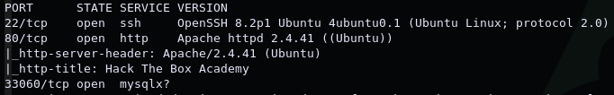
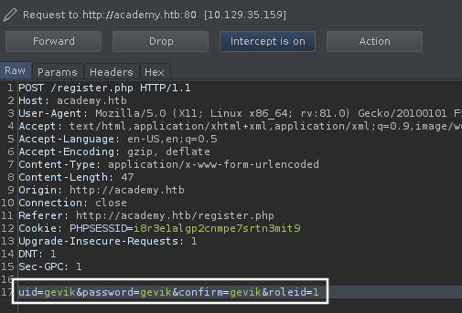
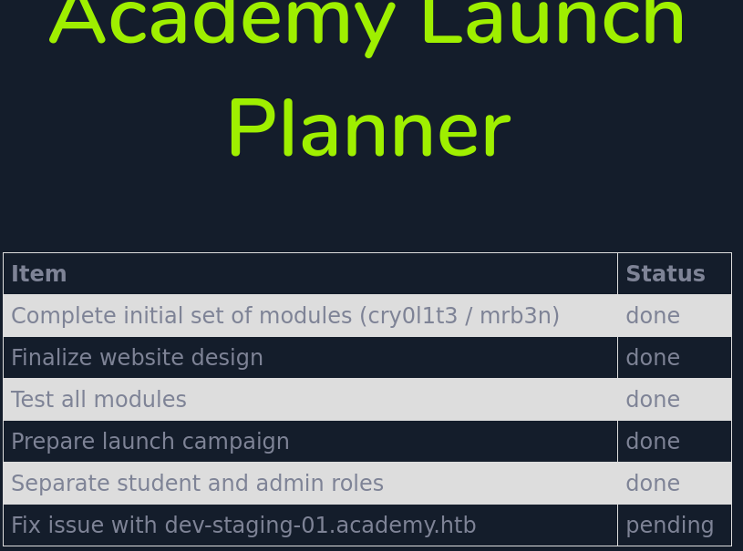

# Academy

[egre55](https://www.hackthebox.eu/home/users/profile/1190) & [mrb3n](https://www.hackthebox.eu/home/users/profile/2984)

1. [Scan/Enumeration](#scan/enumeration)
2. [Gain Shell](#gain-shell)
3. [Privilege Escalation](#privilege-escalation)

******

## [Scan/Enumeration]

Öncelikle hangi portların açık olduğunu anlamak için bütün portları hızlı bir şekilde taratmaya çalışıyorum.

`nmap -T4 -vv -p- <IP>`

Buradan açık olarak gördüğüm portları daha ayrıntılı taratarak hangi servislerin çalıştığını öğrenmeye çalışıyorum.

`nmap -A -p <PORTS> -oN academy.nmap <IP>`

Cihazda: 22 portunda SSH, 80 portunda HTTP, 33060 portunda ise mysqlx servisi çalışıyor. Web servisini incelemeye başlıyorum ve /etc/hosts dosyasına "academy.htb" domain'ini ekliyorum. Bir login sayfası ve bir register sayfası olduğunu, ayrıca register sayfasının kaynak kodunda bulunan `<input type="hidden" value="0" name="roleid" />` satırını fark ediyorum. Alınan input'un adının roleid olmasından farklı rolleri temsil edebileceğini ve muhtemelen 0'ın normal kullanıcı 1'in ise admin olduğunu düşünüyorum. Kayıt olurken gönderdiğim request'i BurpSuite aracılığıyla yakalayıp inceliyorum ve "roleid" isimli bir parametreyi 0 değeriyle yolladığımızı görüp bunun değerini 1 olarak değiştiriyorum.

Kayıt olma işlemi gerçekleştikten sonra beni login.php sayfasına yönlendiriyor fakat burada roleid değerini 1 göndererek kayıt olduğum kullanıcı ile 0 göndererek kayıt olduğum kullanıcının aynı yere "egre55" hesabına geldiğini fark ediyorum. Admin kullanıcısı için farklı bir giriş paneli olacağını düşünerek "admin.php" sayfasına request atıyorum ve burada da bir login page olduğunu görüyorum. Admin yetkisiyle kayıt olduğum kullanıcıyla giriş yaptığımda "Academy Launch Planner" isimli bir sayfa ile karşılaşıyorum.

Buradan "dev-staging-01.academy.htb" isimli bir subdomain olduğunu öğreniyorum ve bunu da /etc/hosts dosyasına ekliyorum. Burada Öncelikle bir mysql username ve şifresi gözüme çarpıyor bunları denemek için mysql ile 33060 portuna bağlanmayı deniyorum fakat "ERROR: " mesajıyla karşılaşıyorum. Bunun üzerine mysqlx'i biraz araştırıp bağlanmak için [mysqsl-shell](https://dev.mysql.com/downloads/shell/) gerektiğini öğreniyorum. Mysql-shell'i kullanarak bulduğum cred'ler ile ve sonrasında tahmin etmeye çalışarak bağlanmayı deniyorum fakat yine başaramıyorum. Bunun üzerine daha fazla gitmek istemiyorum ve bulduğum subdomain'e gobuster taraması yapıyorum. İlginç olabilecek cgi-bin ve web.config dosyalarını buluyorum. Bildiğim kadarıyla cgi-bin'in bulunduğu yerde [shellshock](https://en.wikipedia.org/wiki/Shellshock_%28software_bug%29) zafiyeti olabilir. Bunun için shellshock zafiyetini exploit etmeye çalışıyorum fakat bunu da başaramıyorum. APP_NAME olarak Laravel'i görebiliyorum fakat herhangi bir version bilgisi bulamıyorum bu yüzden metasploit'de var olan tek laravel exploit'ini çalıştırmayı denedim ama bu da olmadı. Bulabileceğim bir exploit ile laravel'den içeriye girebileceğimi düşünerek exploit aramaya devam ettim. Sonunda [Laravel RCE](https://github.com/kozmic/laravel-poc-CVE-2018-15133) için bir PoC bulabildim. 

