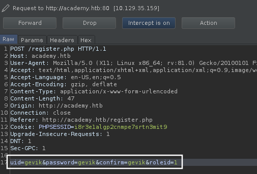

# Academy

[egre55](https://www.hackthebox.eu/home/users/profile/1190) & [mrb3n](https://www.hackthebox.eu/home/users/profile/2984)

1. [Scan/Enumeration](#scan/enumeration)
2. [Gain Shell](#gain-shell)
3. [Privilege Escalation](#privilege-escalation)

******

## [Scan/Enumeration]

Öncelikle hangi portların açık olduğunu anlamak için bütün portları hızlı bir şekilde taratmaya çalışıyorum.

`nmap -T4 -vv -p- <IP>`

Buradan açık olarak gördüğüm portları daha ayrıntılı taratarak hangi servislerin çalıştığını öğrenmeye çalışıyorum.

`nmap -A -p <PORTS> -oN academy.nmap <IP>`

Cihazda: 22 portunda SSH, 80 portunda HTTP, 33060 portunda ise mysqlx servisi çalışıyor. Web servisini incelemeye başlıyorum ve /etc/hosts dosyasına "academy.htb" domain'ini ekliyorum. Bir login sayfası ve bir register sayfası olduğunu, ayrıca register sayfasının kaynak kodunda bulunan `<input type="hidden" value="0" name="roleid" />` satırını fark ediyorum. Alınan input'un adının roleid olmasından farklı rolleri temsil edebileceğini ve muhtemelen 0'ın normal kullanıcı 1'in ise admin olduğunu düşünüyorum. Kayıt olurken gönderdiğim request'i BurpSuite aracılığıyla yakalayıp inceliyorum ve "roleid" isimli bir parametreyi 0 değeriyle yolladığımızı görüp bunun değerini 1 olarak değiştiriyorum.

Kayıt olma işlemi gerçekleştikten sonra beni login.php sayfasına yönlendiriyor fakat burada roleid değerini 1 göndererek kayıt olduğum kullanıcı ile 0 göndererek kayıt olduğum kullanıcının aynı yere "egre55" hesabına geldiğini fark ediyorum. Admin kullanıcısı için farklı bir giriş paneli olacağını düşünerek "admin.php" sayfasına request atıyorum ve burada da bir login page olduğunu görüyorum. Admin yetkisiyle kayıt olduğum kullanıcıyla giriş yaptığımda "Academy Launch Planner" isimli bir sayfa ile karşılaşıyorum.

Buradan "dev-staging-01.academy.htb" isimli bir subdomain olduğunu öğreniyorum ve bunu da /etc/hosts dosyasına ekliyorum. Burada Öncelikle bir mysql username ve şifresi gözüme çarpıyor bunları denemek için mysql ile 33060 portuna bağlanmayı deniyorum fakat "ERROR: " mesajıyla karşılaşıyorum. Bunun üzerine mysqlx'i biraz araştırıp bağlanmak için [mysqsl-shell](https://dev.mysql.com/downloads/shell/) gerektiğini öğreniyorum. Mysql-shell'i kullanarak bulduğum cred'ler ile ve sonrasında tahmin etmeye çalışarak bağlanmayı deniyorum fakat yine başaramıyorum. Bunun üzerine daha fazla gitmek istemiyorum ve bulduğum subdomain'e gobuster taraması yapıyorum. İlginç olabilecek cgi-bin ve web.config dosyalarını buluyorum. Bildiğim kadarıyla cgi-bin'in bulunduğu yerde [shellshock](https://en.wikipedia.org/wiki/Shellshock_%28software_bug%29) zafiyeti olabilir. Bunun için shellshock zafiyetini exploit etmeye çalışıyorum fakat bunu da başaramıyorum. APP_NAME olarak Laravel'i görebiliyorum fakat herhangi bir version bilgisi bulamıyorum. Bulabileceğim bir exploit ile laravel'den içeriye girebileceğimi düşünerek exploit aramaya devam ettim. Sonunda [Laravel RCE](https://github.com/kozmic/laravel-poc-CVE-2018-15133) için bir PoC bulabildim. 

******

## [Gain Shell]

Gerekli olan [phpgcc](https://github.com/ambionics/phpggc)'yi de indirdekten sonra netcat reverse shell için payload oluşturup base64 ile şifreledim.

PoC'daki php dosyasını kullanarak bulduğumuz subdomain'de yer alan APP_KEY ile oluşturduğumuz payload'ı birleştiriyoruz.

Oluşturduğumuz payload'ı curl aracılığıyla subdomain'e göndererek reverse shell alabiliyoruz.

******

## [Privilege Escalation]

Herhangi bir ssh dosyası bulabilmek için home dizinindeki bütün kullanıcıları kontrol ediyorum. Home dizininde 6 farklı kullanıcı olması horizontal privilege escalation yapacağımız hakkında bir fikir veriyor. Bunun için cihaza linpeas'i göndererek daha hızlı inceleme yapmaya karar veriyorum. Linpeas'in "key folder"ların içinde "pwd" ya da "passwd" kelimelerini getirdiği bölümde birkaç şifre gözüme çarpıyor.

Bulduğum bütün şifreleri /home dizinindeki bütün kullanıcılar için tek tek deniyorum ve "cry0l1t3" kullanıcısına giriş yapmayı başarıyorum.

Daha kullanışlı bir shell'e sahip olmak için cry0l1t3 kullanıcısına ssh ile bağlanıyorum ve /bin/bash'e geçiyorum. Kullanıcının sudo ile çalıştırabileceği herhangi bir dosya bulunmamakta. Yine linpeas çalıştırıp output'unu inceliyorum fakat dikkate değer pek bir şey bulamıyorum. "id" komutunun çıktısında kullanıcının "adm" grubunda olduğunu görmüştük bu grubun ne olduğu hakkında biraz araştırma yaptıktan sonra /var/log dizininin altındaki logları okuyabilen bir grup olduğunu öğreniyorum. Burada uzun bir süre logların çoğuna göz gezdirmeye çalışıyorum fakat kayda değer bir şey dikkatimi çekmiyor. Muhtemelen loglarda diğer 5 kullanıcıdan birine ait şifre olması gerektiğini düşünerek `grep -hr <kullanıcıadı> 2>>/dev/null` şeklinde bütün kullanıcıların isimlerini kontrol ediyorum. Yalnızca "egre55" ve "mrb3n" kullanıcı adlarını içeren dosyalar olduğunu görüyorum. Daha önce yaptığım linpeas taramasından "egre55" kullanıcısının sudo,lxd,admin gibi bir çok gruba dahil olduğunu görmüştüm bu yüzden bu kullanıcının makine hazırlanırken kullanıldığını ve yetki yükseltmek için bu kullanıcıyı kullanmayacağımızı düşünüyorum ve "mbr3n" üzerine yoğunlaşıyorum. grep komutuyla okuma iznim olan dosyalardan hangisinde "mbr3n"ın geçtiğini bulmaya çalışıyorum. "audit" dizininin içindeki "audit.log.3" dosyasında "mbr3n" ve "/usr/bin/su" birlikte geçtiği için burada işime yarayacak bir şeyler olabileceğini düşünüyorum. Uzun uzun dosyayı okuyorum ve sonunda dosyada "data=xxxxxxxxxxxxxx" şeklinde "xxxxx" kısmı hex kodu olarak terminale girilen komutların bulunduğunu fark ediyorum. Birkaçına baktıntan sonra "su" komutunun karşısında hex halinde mrb3n kullanıcısına ait şifreyi buluyorum.

Kullanıcının sudo yetkisini kontrol ettiğimde composer için sudo yetkimiz olduğunu görüyorum. 

GTFOBins aracılığıyla composer'i sudo yetkisiyle çalıştırarak root kullanıcıya geçebiliyorum.

