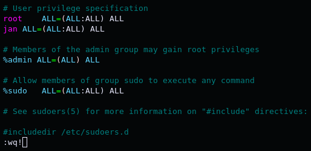

# Basic Pentesting

*"This is a machine that allows you to practise web app hacking and privilege escalation"* -[ashu](https://tryhackme.com/p/ashu)

1. [Scan/Enumeration](#scan/enumeration)
2. [Gain Shell](#gain-shell)
3. [Privilege Escalation](#privilege-escalation)

******

## [Scan/Enumeration]

Nmap taraması yaparak başlıyoruz.

`nmap -A -oN basic.nmap <IP>`

Cihazda: 80, 8009 ve 8080 portlarında web servisleri, 139 ve 445 portlarında samba servisi, 22 portunda ise SSH çalışmakta. Web sayfalarına bakmadan önce samba servisinde anonymous olarak erişebileceğimiz dosyalar olup olmadığını kontrol etmek istiyorum.

`smbclient -L <IP>`

"Anonymous" isminde bir paylaşım olduğunu görüyorum ve yine smbclient aracılığıyla bağlanıyorum.

`smbclient \\\\<IP>\\Anonymous`

Burada bulduğumuz staff.txt isimli dosyanın içinde birinin çalışanları burada önemli dosya paylaşımı yapılmaması için uyardığını görüyoruz. Dosyanın içinde iki adet çalışanın kullanıcı adı olabilecek isimleriyle karşılaşıyoruz: Jan ve Kay. 

80 portunu kontrol edip sayfanın tadilatta olduğunu söyleyen bir notla karşılaşıyorum. Bir de yorum satırı olarak eklenmiş neyin çalıştığını öğrenmek için "dev note"u kontrol etmemizi söyleyen yazıyla. Bir kaç olası "dev note" kombinasyonunu deniyorum fakat başarıya ulaşamıyorum. Dizin taraması yapmak için gobuster'ı kullanıyorum.

`gobuster dir -u http://<IP> -w <WORDLIST> -t 64`

******

## [Gain Shell]

"/development" isminde bir dizin buluyorum. Burada dev.txt ve j.txt olmak üzere iki text dosyasıyla karşılaşıyorum. dev.txt kurulan uygulamalarla ilgili bir konuşma içerirken j.txt'de "K"in "J" için yazdığı not bulunuyor. Daha önceden Jan ve Kay isimlerini bulduğumuz için bu konuşanların yine Jan ve Kay olduklarını anlayabiliriz. Kay, Jan'in şifresini kolay bir şekilde kırabildiğini söylüyor. Bunun üzerine hydra'yı kullanarak Jan kullanıcı adına ssh üzerinden bruteforce saldırısı yapmaya karar veriyorum.

`hydra -l jan -P <WORDLIST> <IP> ssh -t 64`

******

## [Privilege Escalation]

Jan kullanıcısı olarak shell almayı başardık fakat kullanıcının herhangi bir sudo yetkisi bulunmuyor. Kay kullanıcısının home dizininde işimize yarayabilecek bir şey var mı diye kontrol ediyorum ve pass.bak isimli bir dosya buluyorum fakat dosya bir tek kay'ın okuyabileceği izinlerle duruyor. ".ssh" dizininde authorized_keys'e kendi public key'imi yazmayı ummuştum fakat yazma izini sadece kay'a ve kay'ın grubuna verilmiş durumda. Bunun yerine .ssh dizinindeki şifreli id_rsa'ı alıp john ile kırmayı denemeye karar veriyorum fakat önce cihazdaki SUID dosyalarını da kontrol etmek istiyorum.

`find / -user root -perm -4000 -exec ls -ldb {} \; 2>/dev/null`

vim.basic'in SUID dosyası olarak bulunduğunu görüyorum. Bunu kullanarak /etc/sudoers dosyasında Jan kullanıcısı için sudo yetkisi yazabiliriz.

Düşündüğüm gibi dosyaya yazabiliyorum ve sudo yetkisini kullanarak root kullanıcıya geçiyorum.

