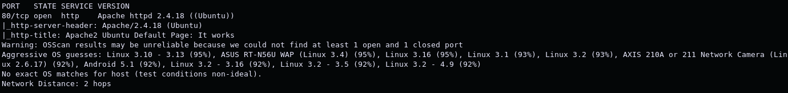
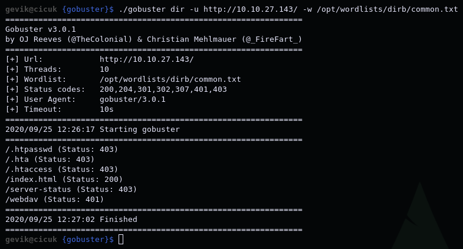
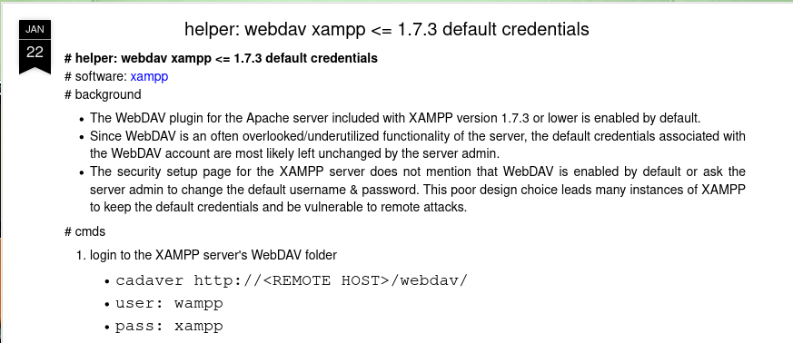
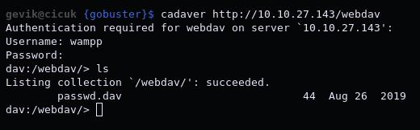
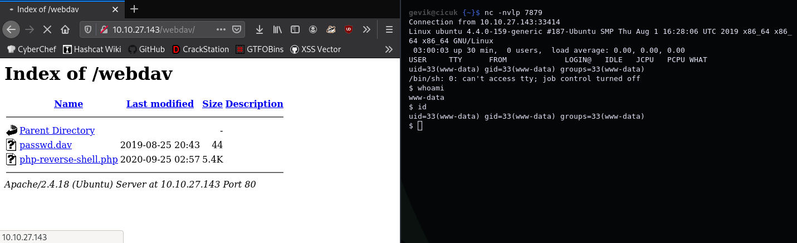
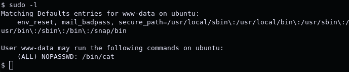
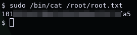

# Dav

*"boot2root machine for FIT and bsides guatemala CTF"* -[stuxnet](https://tryhackme.com/p/stuxnet)

1. [Scan/Enumeration](#scan/enumeration)
2. [Gain Shell](#gain-shell)
3. [Privilege Escalation](#privilege-escalation)

******

## [Scan/Enumeration]

We can start by doing an nmap scan.

`nmap -sVC -oN dav.nmap <IP>`

As you can see, only port 80 is open. If you look at the site you will see that it is a normal apache page. We can do directory scan with the gobuster. I will use [common.txt](https://github.com/danielmiessler/SecLists/blob/master/Discovery/Web-Content/common.txt).

`gobuster dir -u http://<IP>/ -w <wordlist>`

We found a directory called "webdav". We need a password to enter this directory. So let's search this: "webdav default password"

Try this information and you will see that it works.

******

## [Gain Shell]

If we are able to install [php reverse shell](https://github.com/pentestmonkey/php-reverse-shell/blob/master/php-reverse-shell.php) on the page we are logged in, we can get a shell. We will use the cadaver tool to do this.

`cadaver http://<IP>/webdav`

Now we can upload file with "put" command.

`put php-reverse-shell.php`

Now, while listening to the port with nc, we need to run the file we uploaded through the site.

`nc -nvlp <port>`

******

## [Privilege Escalation]

We can use the "sudo -l" command to see the commands we can use with the sudo authority.

`sudo -l`

We can use cat command. We can read the /root/root.txt file.

