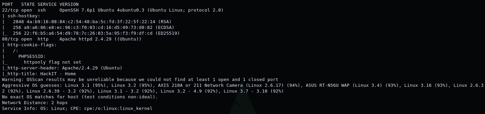
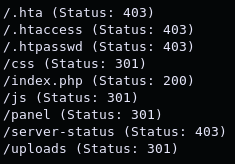
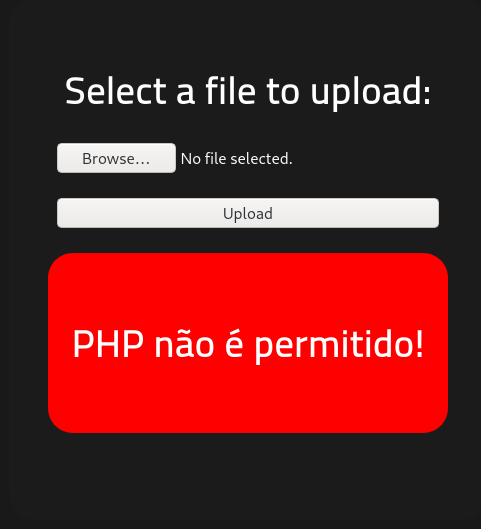
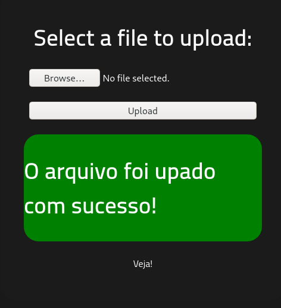
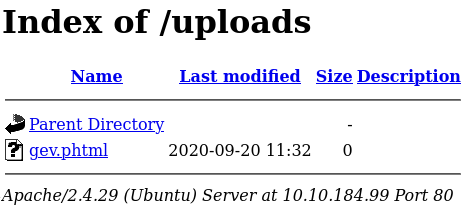
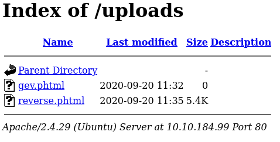
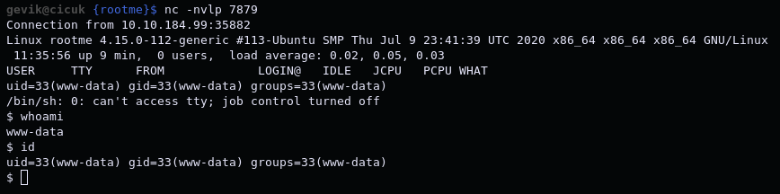
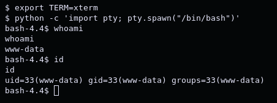
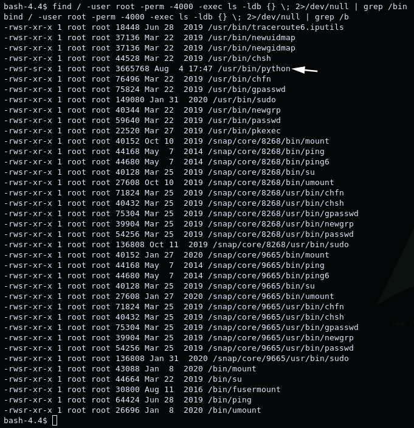
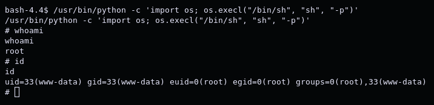

# RootMe

*"A ctf for beginners, can you root me?"* -[ReddyyZ](https://tryhackme.com/p/ReddyyZ)

Dificulty: *Easy*

1. [Scan/Enumeration](#scan/enumeration)
2. [Gain Shell](#gain-shell)
3. [Privilege Escalation](#privilege-escalation)

******

## [Scan/Enumeration]

First of all, we can do nmap scan.

`nmap -A -oN rootme.nmap <ip>`

As you can see, SSH service is running on port 22 and Apache web server is running on port 80. For the web server, we can do directory scan with the gobuster. I will use [common.txt](https://github.com/v0re/dirb/blob/master/wordlists/common.txt) list for this scan.

`gobuster dir -u http://<ip>/ -w common.txt`

Especially the /panel and /upload directories look interesting. If we check these directories, we will see that the uploads directory is empty, and the panel directory is a page that allows us to upload files.
******

## [Gain Shell]

If we can access the files we uploaded here from the uploads directory, we can try the [php reverse shell](https://github.com/pentestmonkey/php-reverse-shell/blob/master/php-reverse-shell.php). Let's try uploading a php file.

`touch gev.php`

We have learned that files with .php extensions are not allowed. To get rid of this problem, we can do a small search of duckduckgo. We can do a search like ["php file extensions"](https://www.lifewire.com/php-file-4138559). I found something in this search result: **"Some PHP Source Code files might use a different file extension like .PHTML, PHP3, PHP4, PHP5, PHP7 or PHPS."** We can try any one we want. I will try the phtml extension.

Yes it worked. Let's download [php_reverse_shell](https://github.com/pentestmonkey/php-reverse-shell/blob/master/php-reverse-shell.php), write our own ip address and port and upload it to the site. If we run the file we uploaded from the /uploads directory while listening to the port with nc, we will get a shell.

`nc -nvlp <port>`

******

## [Privilege Escalation]

First of all, let's make shell more beautiful.

`export TERM=xterm`

`python -c 'import pty; pty.spawn("/bin/bash")'`

Now we can find the SUID files.

`find / -user root -perm -4000 -exec ls -ldb {} \; 2>/dev/null | grep /bin`

We found /usr/bin/python in SUID files. Let's take a look at [GTFOBins](https://gtfobins.github.io/gtfobins/python/). We can use SUID section.

`/usr/bin/python -c 'import os; os.execl("/bin/sh", "sh", "-p")'`

And now we are root user.
