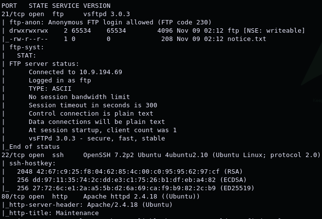
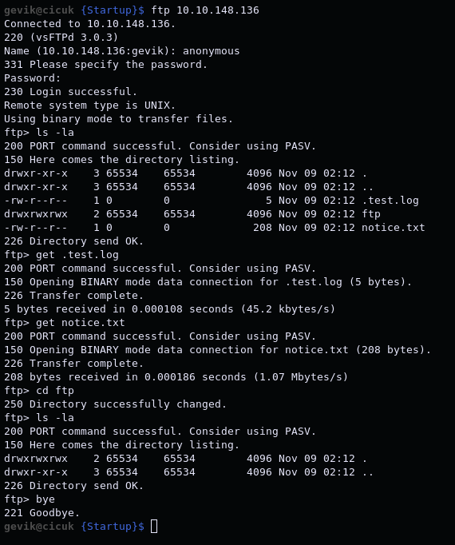
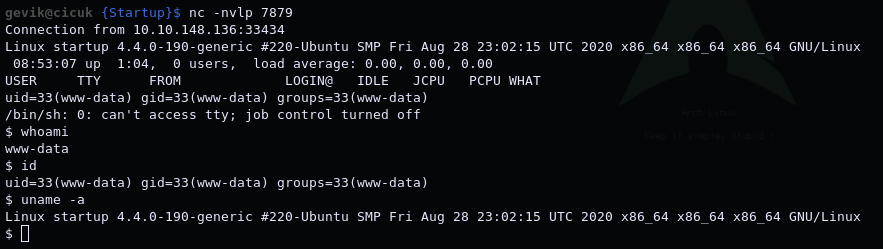
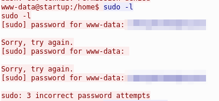
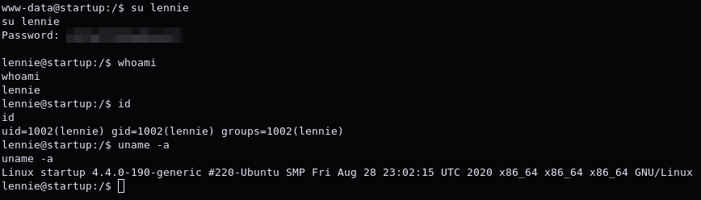
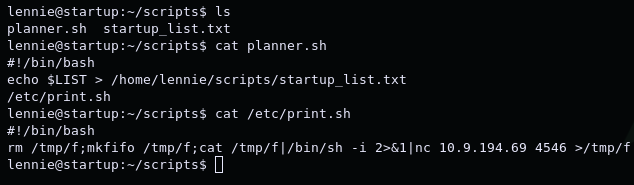
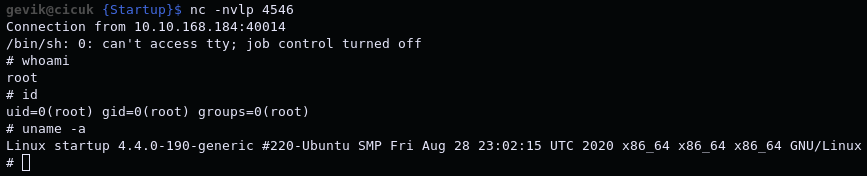

# Startup

*"Abuse traditional vulnerabilities via untraditional means."* -[r1gormort1s](https://tryhackme.com/p/r1gormort1s)

Dificulty: *Easy*

1. [Scan/Enumeration](#scan/enumeration)
2. [Gain Shell](#gain-shell)
3. [Privilege Escalation](#privilege-escalation)

******

## [Scan/Enumeration]

Nmap taraması yaparak başlıyorum.

Cihazda: 21 portunda FTP, 22 portunda SSH, 80 portunda HTTP servisi çalışıyor.

FTP'de anonymous olarak girişe izin verildiğini nmap çıktısından görebiliyorum. Giriş yapıp içerideki dosyaları kendi bilgisayarıma alıyorum.

Burada bulduğumuz dosyaların içinde kullanıcı adı olabilecek "maya" kelimesini buluyorum. Dosyalar içinde ilgi çekici başka bir şey bulamıyorum bu yüzden web sitesine bakmaya başlıyorum. İndex'e koydukları yazıda sitenin geliştirme aşamasında olduğu yazıyor. Gobuster ile dizin taraması yapıyorum. Dizin taraması ile "files" isimli bir dizin buluyorum ve içindeki dosya ftp sunucusunda bulduğumuz dosya ile aynı. Tek fark burada .test.log dosyası bulunmuyor. Başka bir sonuç bulamadığım için ftp versiyonuna ait exploit araştırmaya başlıyorum. Bu sırada bir çok farklı file extension'ı ile dizin taramasına devam ediyorum. 

******

## [Gain Shell]

Bu sırada FTP'nin içindeki ftp dizinine yazma iznimiz olduğunu gözümden kaçırdığımı fark ediyorum. PHP için info verecek bir php dosyası yazıp ftp dosyasının içine "put" komutu ile koyuyorum. Websitesi üzerinden bulduğumuz files dizinini kontrol ettiğimde dosyamızın buraya geldiğini ve phpinfo'nun çalıştığını görüyorum. Aynı şekilde php için bir reverse shell yükleyip www-data olarak shell alabiliyorum.

Makinede biraz bakındıktan sonra kök dizini altında olmaması gereken bir kaç dizin göze çarpıyor. Bunlardan birisi www-data yetkisiyle var ve içinde .pcapng uzantılı bir dosya var. Makinede python aracılığıyla dosyayı paylaşıp kendi bilgisayarıma alıyorum.

`python3 -m http.server <PORT>`
`wget http://<IP>:<PORT>/suspicious.pcapng`

******

## [Privilege Escalation]

Dosyayı kendi bilgisayarımda wireshark aracılığıyla inceliyorum. Burada TCP paketlerinin içinde linux kodlarının gönderildiğini görüp paketlerden birini sağ tıklayıp "Follow > TCP Stream" yapıyorum ve burada çalıştırılan komutlar ve çıktılarını görüyorum. www-data kullanıcısı için denenmiş bir şifre ile karşılaşıyorum.

Bu şifreyi www-data, vagrant ve lennie kullanıcıları için deniyorum. Lennie olarak giriş yapmayı başarıyorum.

Daha rahat bir shell'e sahip olabilmek için bulduğum şifreyi kullanarak makineye SSH ile bağlanıyorum ve /bin/bash'e geçiyorum. Kullanıcının home dizininde "scripts" isimli bir dizin var ve içinde bir bash script ve bir txt dosyası var. Script, $LIST değişkenine tanımlanan şeyi txt dosyasına yazdırıyor ve sonrasında /etc/print.sh dosyasını çalıştırarak ekrana "done" yazdırmasını sağlıyor. Bizim buradaki script'e yazma yetkimiz yok ama /etc/print.sh dosyasına yazma yetkimiz var. Muhtemelen bu dosya cronjob olarak root yetkisiyle belirli aralıklarla çalışıyor bu yüzden /etc/print.sh dosyasını reverse shell alacak şekilde düzenleyip bir süre beklersek shell alabileceğiz.

Netcat ile portu dinleyip bir süre bekledikten sonra root olarak shell'e bağlanabiliyorum.

