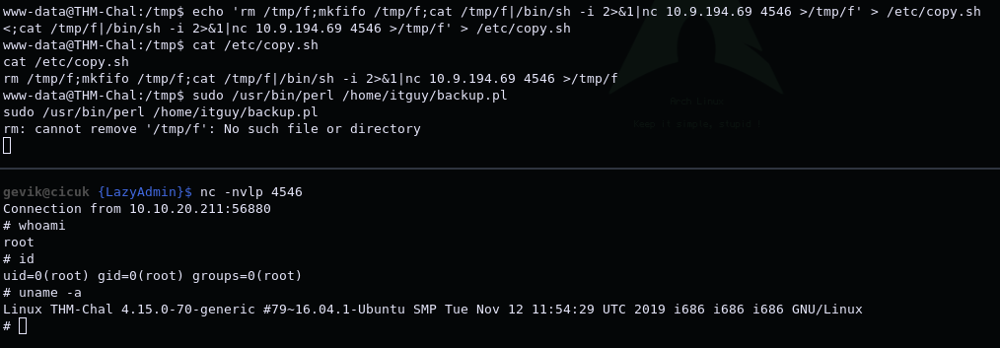

# Lazy Admin

*"Easy linux machine to practice your skills"* -[MrSeth6797](https://tryhackme.com/p/MrSeth6797)

1. [Scan/Enumeration](#scan/enumeration)
2. [Gain Shell](#gain-shell)
3. [Privilege Escalation](#privilege-escalation)

******

## [Scan/Enumeration]

Nmap taraması yaparak başlıyorum.

Cihazda 22 portunda SSH ve 80 portunda HTTP servisleri çalışıyor. Web servisine baktığımda default olarak gelen apache sayfasının durduğunu görüyorum. Sayfanın source kodlarını inceleyip işime yarayabilecek bir şey bulamıyorum ve gobuster ile dizin taraması yapıyorum. Dizin taramasının sonucunda "/contect" dizinini buluyorum ve bu dizinin index'inden sunucuda SweetRice'ın çalıştığını öğreniyorum ve SweetRice için exploit aramaya başlıyorum. İlk olarak bulduğum bir [exploit-db sayfasında](https://www.exploit-db.com/exploits/40718) "/inc/mysql_backup" dizininde mysql backup'larının bulunduğunu öğreniyorum ve `http://<IP>/content/inc/mysql_backup/`'a giderek oradaki dosyayı indiriyorum.

İndirdiğim dosyayı `cat <file> | grep passwd` komutu ile okuyorum ve karşılaştığım çıktıda admin parametresinin karşısındaki kullanıcı adı ve passwd parametresinin karşısındaki hash dikkatimi çekiyor. Hash'in md5 olduğunu öğreniyorum ve [CrackStation](https://crackstation.net/) aracılığıyla hash'i kırabiliyorum.

******

## [Gain Shell]

Bir kullanıcı adı ve şifreye ulaşabiliyorum fakat bunları girebileceğim bir panel'i hala bilmiyorum. Bu paneli bulmak için gobuster ile dizin taraması yapabilirim fakat önce bulduğum diğer exploitleri incelemeye karar veriyorum. Bu [exploit'lerden](https://www.exploit-db.com/exploits/40716) birisi server'a dosya yüklemek için kullanılıyor ve kodunda da görüldüğü gibi kullanıcı adı ve şifreye ihtiyaç duyuyor. Buradan giriş sayfasının "/as" dizininde olduğunu öğreniyorum ve bu exploiti kullanmak yerine içeriye bakmaya karar veriyorum. Giriş yaptığımda soldaki paneli biraz inceledikten sonra "Theme" bölümünden temaların php dosyalarını editleyebildiğimi görüyorum ve comment_form.php olanını kendim için bir reverse shell'e dönüştürdükten www-data kullanıcısı olarak shell alabiliyorum.

******

## [Privilege Escalation]

Giriş yaptığım gibi home dizininde bulunan kullanıcının dosyalarını incelemeye başlıyorum. Burada mysql_login.txt isminde mysql için bir kullanıcı adı ve şifre içeren dosya buluyorum. Mysql'e bağlanıp "website" isimli database'i inceliyorum fakat işime yarayacak bir şey bulamıyorum. Sonrasında www-data kullanıcısi ile `sudo -l` komutunu çalıştırdığımda itguy kullanıcısının home dizinindeki backup.pl dosyasını perl ile birlikte root yetkisini kullanarak çalıştırabiliyorum. "backup.pl" dosyasını incelediğimde ise /etc/copy.sh dosyasını çalıştırdığını görüyorum ve bu dosyaya baktığımda dosya üzerinde düzenleme yetkim olduğunu görüyorum. Bu dosyanın içerisine echo ile bir reverse shell yazıyorum ve sudo yetkimi kullanarak backup.pl dosyasını çalıştırdığımda root kullanıcısı olarak shell alabiliyorum.

