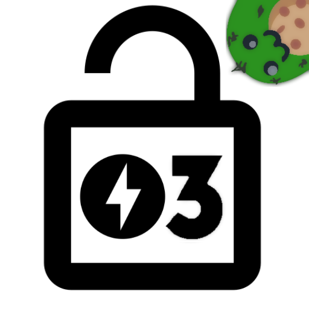
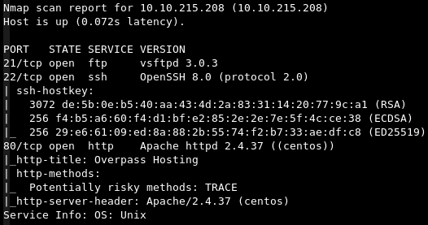
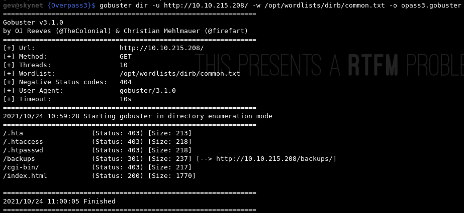
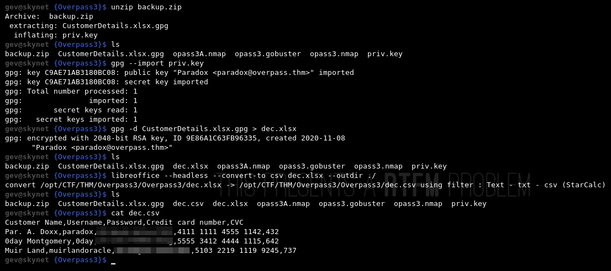
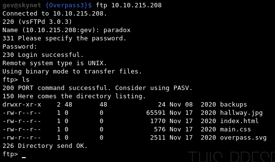
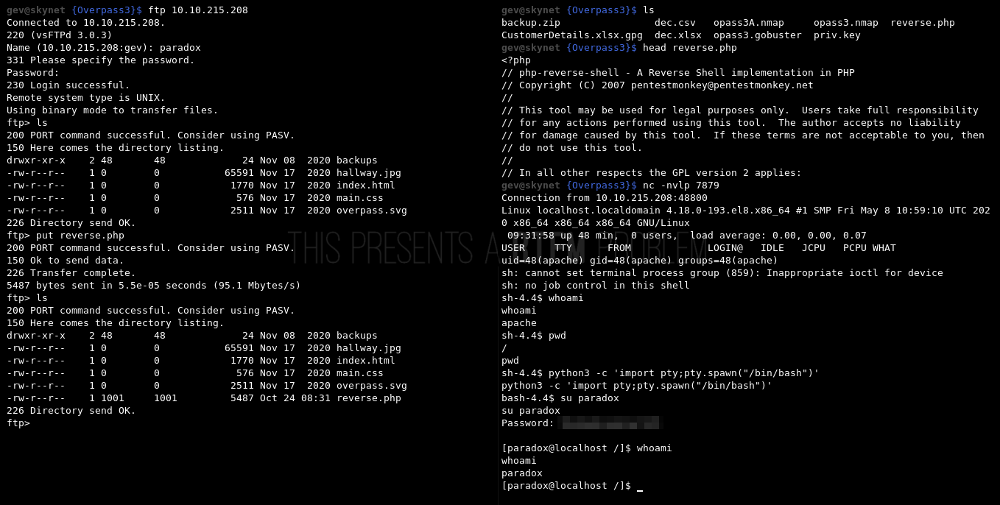
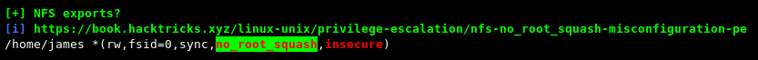
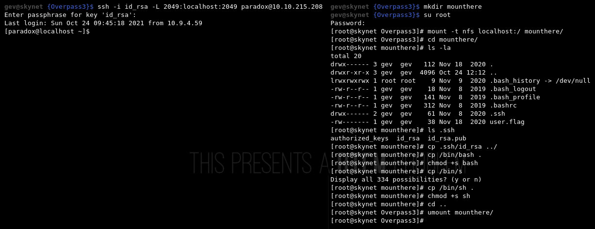
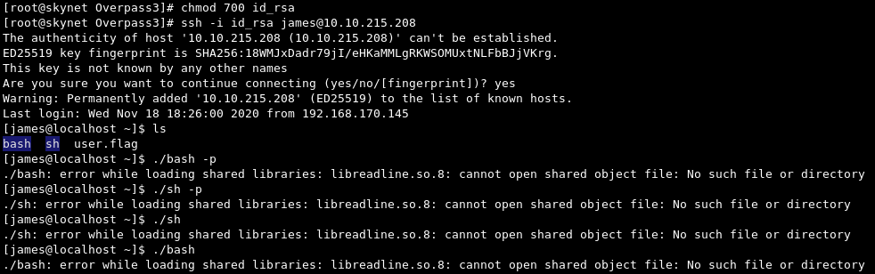
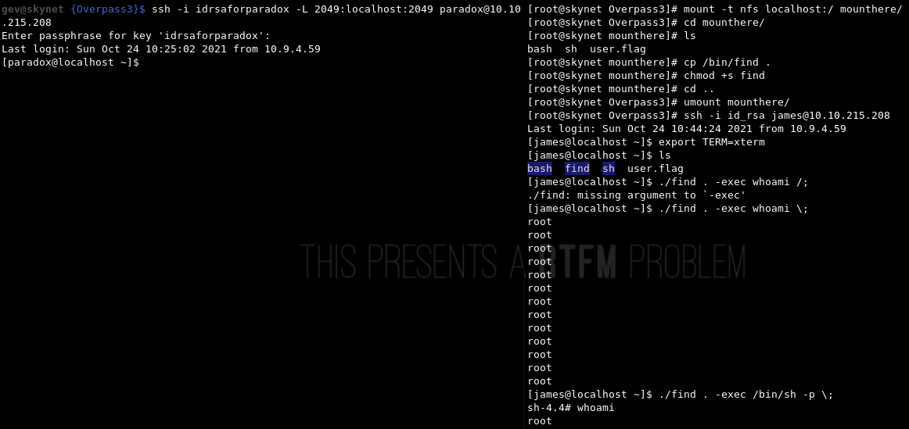

# Overpass 3

*"You know them, you love them, your favourite group of broke computer science students have another business venture! Show them that they probably should hire someone for security..."* -[NinjaJc01](https://tryhackme.com/p/NinjaJc01)

Difficulty: *Medium*

1. [Scan/Enumeration](#scan/enumeration)
2. [Gain Shell](#gain-shell)
3. [Privilege Escalation](#privilege-escalation)

## [Scan/Enumeration]

I'm starting with a regular nmap scan.

`nmap -T5 -vv -p- -oN opass3R.nmap <IP>`

I see 80,22,21 and i do an aggressive scan against those ports.

`nmap -A -p 80,22,21 -oN opass3A.nmap <IP>`

We have HTTP on 80, SSH on 22 and FTP on 21. I'm trying to anonymous login for FTP but it can't work. I chec the website but i can't find anything useful. I'm trying to find directories with gobuster.

`gobuster dir -u http:/<IP>/ -w <WORDLIST> -o opass3.gobuster`

There is a backup directory and we have a backup.zip inside this directory. 

## [Gain Shell]

In this backup.zip we have an encrypted xlsx file and a pgp private key. I decrypt xlsx file with gpg and private key and convert the xlsx to csv cause I want to read this file from terminal.

Inside this file we have several user credentials. I think one of them will work for FTP, but I'm still trying for SSH. After this I'm trying it's for FTP and one of them work.

As it can be easily understood, we can directly access the files of the website. So we can upload a php reverse shell in here. After connect the machine, I can change user to paradox with him credentials. I added my ssh public key to him authorized_keys, so I can connect with SSH.

## [Privilege Escalation]

In here, I was try to check SUID files, capabilities, crontabs and important directories but I couldn't find anything. I decide to use linPeas and I found an important thing.

We have a misconfigured NFS. This configuration meaning if we can mount this partition with root user and create a file with root user, it will be stay as root user' file on machine. So we need mount this NFS with root user but the problem is, we can only access this in localhost and we aren't root user on localhost. In order to work as root user, we need to port tunneling to our own machine with SSH. After port tunneling, we can copy bash or sh as a SUID file. And if we can connect james user with an id_rsa or anything else, we can run that binary with SUID permission.

`ssh -L <localport>:<localip>:<remoteport> <connection-creds>`

And now, I can try to connect james user with id_rsa and run that binaries. 

It doesn't work but atleast we can create SUID files, so I'm trying to use bash script instead of copy binaries. I can't find a way take root with bash scripts. So I try different binaries and I do it with 'find' binary.

