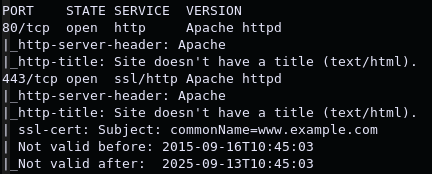
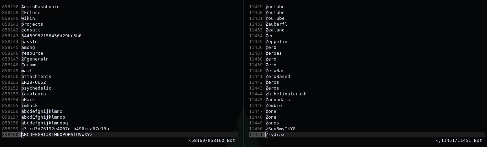
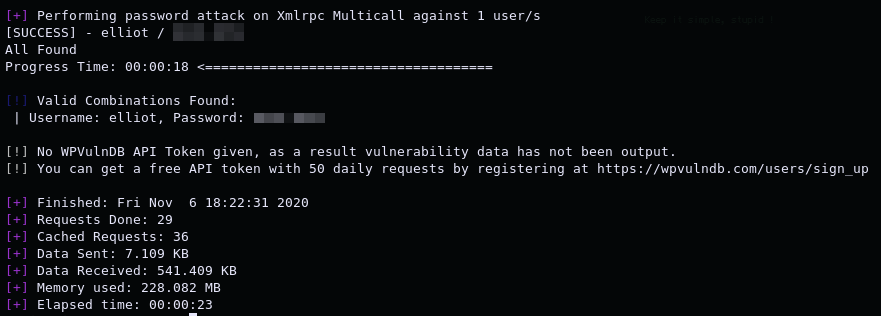
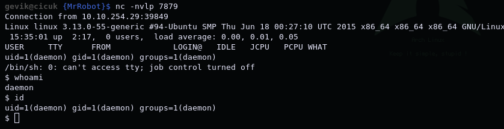
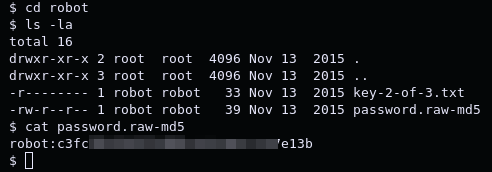
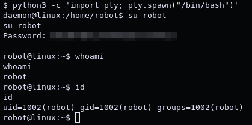
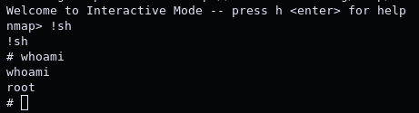

# Mr. Robot CTF

*"Based on the Mr. Robot show, can you root this box?"* -[stuxnet](https://tryhackme.com/p/ben)

1. [Scan/Enumeration](#scan/enumeration)
2. [Gain Shell](#gain-shell)
3. [Privilege Escalation](#privilege-escalation)

******

## [Scan/Enumeration]

Nmap taraması yaparak başlayabiliriz.

`nmap -A -oN robot.nmap <IP>`

Yalnızca web portlarının açık olduğunu görebiliyoruz. 80 portuna browser aracılığıyla bağlanıp biraz bakındıktan sonra, arama motorlarının sitede yolunu bulmak için kullandıkları "robots.txt" dosyasına bakıyorum ve 2 adet dosya ile karşılaşıyorum. Bu dosyalardan biri odanın bizden istediği key'lerden ilkini içerirken diğeri 858160 kelime içeriyor. Bulduğumuz wordlist'i bir bruteforce saldırısında kullanacağımızı düşünerek içinde birden fazla kez yazılan kelimeleri çıkarıp alfabetik olarak sıralıyorum.

`sort -u <FILE> > <NEWFILE>`

Siteye gobuster taraması yaparak "/wp-admin" sayfasındaki login page'i buluyorum. Öncelikle olası bir kaç default cred'ler ile giriş denemesi yapıyorum. Başaramıyorum ama kullanıcı adlarına "user is not here" cevabını verdiğini görerek sistemde var olan bir kullanıcı adı girdiğimde bu cevabı almayacağımı anlıyorum. Olası kullanıcı adlarını bulmak için "Mr Robot" isimli dizinin IMDb sayfasından yararlanarak "elliot" kullanıcı adının sisteme kayıtlı olduğunu öğreniyorum. Wpscan aracılığıyla düzenlediğimiz wordlist'i kullanarak bruteforce saldırısına başlıyorum.

`wpscan --url http://<IP> -P <wordlist> --usernames elliot`

## [Gain Shell]

Wordpress'e giriş yaptıktan sonra appearance menüsündeki 404 template'i php reverse shell olarak ayarlayıp deamon olarak shell alıyorum.

Home dizini altında bulunan kullanıcıların dosyalarına bakarken robot kullanıcısının şifresinin md5 halinin olduğu bir dosya buluyorum.

Bu hash'i kırmak için hashcat ve rockyou.txt'yi kullanmadan önce online olarak hash'i kırmaya çalışan [sitelerden](https://crackstation.net/) birini deniyorum ve hashcat'e gerek kalmadan şifreyi alabiliyorum. Aldığım shell'de kullanıcı değiştirebilmek için python'u kullanarak /bin/bash'e geçiyorum ve robot kullanıcısına geçiş yapabiliyorum.

## [Privilege Escalation]

Öncelikle kullanıcının şifresine sahip olduğumuz için sudo yetkisini kontrol ediyorum fakat herhangi bir şeyde sudo kullanamadığımızı öğreniyorum. İkinci olarak da SUID dosyalarını kontrol ediyorum ve nmap'in SUID dosyaları arasında olduğunu görüyorum. [GTFOBins](https://gtfobins.github.io/) aracılığıyla SUID dosyası olan nmap'i kullanarak nasıl yetki yükseltebileceğimi öğreniyorum.

