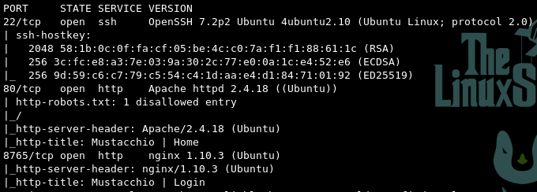
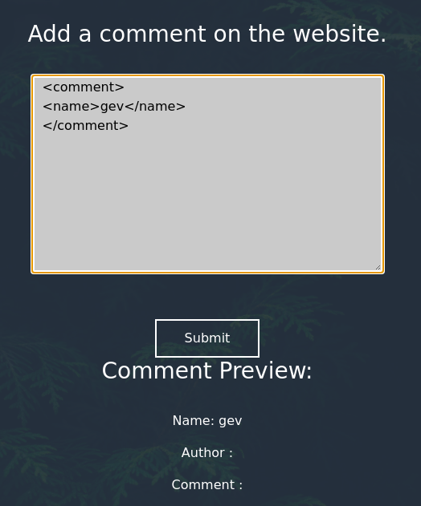
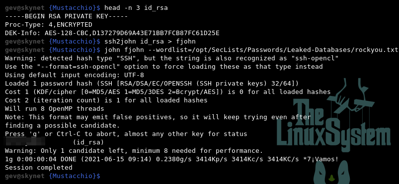

# Mustacchio

[](https://tryhackme.com/room/mustacchio)

"Easy boot2root Machine" -[zyeinn](https://tryhackme.com/p/zyeinn)
```html
Difficulty: <span style="color: green;">Easy</span>
```

1. [Scan/Enumeration](#scan/enumeration)
2. [Gain Shell](#gain-shell)
3. [Privilege Escalation](#privilege-escalation)

******

## [Scan/Enumeration]

I'm starting with doing nmap scan. Fristly I'm scanning all port with -T5 and -p- parameters and after that, I'm scanning the found ports with -A parameter.



We have SSH on 22, HTTP on 80 and 8765. I'm checking web page, source codes and robots.txt on 80 port but I can't find anything. I'm doing gobuster scan with [common.txt](https://github.com/danielmiessler/SecLists/blob/master/Discovery/Web-Content/common.txt) wordlist.


Files starting with .ht are config files for apache server and they are forbidden for us. So we need to check others. /images and /fonts are more usual than the /custom so we can start with check to /custom. There is nothing but css files in css directory inside custom directory. But in js directory, we have a backup file named users.bak. I'm checking file type with `file <file>` command and I see it is an SQLite file. You can try to read this also with cat or strings commands but i will read with sqlite3.


We get a username and a hashed password. We can crack the hash on [crack station](https://crackstation.net/). This creds doesn't work on SSH so we need a login page and we have a web page that we don't check on 8765. As we entered here, we encounter a login page and we can log in with what we have.

## [Gain Shell]

Inside we have a input box. I'm trying to give random texts but I can't get one. When I try submit the empty box, I see that warning: 'Insert XML Code!'. So we need to give xml input on this box. I'm trying a couple of tag with the help of the texts on the page. Finally i find this:



Now we can give input and see output on the page. If you google 'XML vulnerabilities', you encounter XXE. You can learn how to exploit it with help of several [resources](https://portswigger.net/web-security/xxe). I'm using this:

`<!DOCTYPE foo [ <!ELEMENT foo ANY > <!ENTITY gev SYSTEM  "file:///etc/passwd" >]>
<comment>
<name>&gev;</name>
</comment>`

In passwd file I find two user: joe and barry. I can connect ssh with their id_rsa key so im trying find id rsa on '/home/joe/.ssh/id_rsa' and '/home/barry/.ssh/id_rsa'. I find barry's id_rsa file and I see it is encrypted. I'm cracking it with john and [rockyou.txt](https://github.com/danielmiessler/SecLists/blob/master/Passwords/Leaked-Databases/rockyou.txt.tar.gz).



Now we need change id_rsa privilege with `chmod 600 id_rsa` command. After that we can connect ssh with id_rsa.

`ssh -i id_rsa barry@<ip>`

## [Privilege Escalation]

I'm trying `sudo -l` but we need barry's password for this. I check suid files with `find / -perm -4000 2>/dev/null` and i see '/home/joe/live_log' file. When i execute this file i see connection logs. I use the strings command to fully understand what the file is doing. I see this lines:

`Live Nginx Log Reader                                                                                                                                       
tail -f /var/log/nginx/access.log`

I understand when i run this file, the file run this tail command with root privilege. I can exploit this with change the PATH variable. I'm going to /dev/shm directory and create a simple bash file named tail:

`#!/bin/bash
bash`

I do this file executable with `chmod +x tail` and add /dev/shm path to PATH variable.


