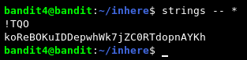
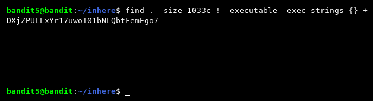
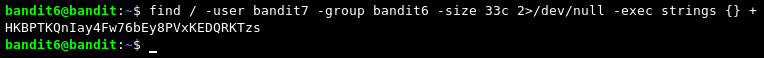

# Wargames / Bandit

[*"The Bandit wargame is aimed at absolute beginners. It will teach the basics needed to be able to play other wargames."*](https://overthewire.org/wargames/bandit/)

0. [Level 0](#level-0) | 6. [Level 6](#level-6)
1. [Level 1](#level-1) | 7. [Level 7](#level-7)
2. [Level 2](#level-2) | 8. [Level 8](#level-8)
3. [Level 3](#level-3) | 9. [Level 9](#level-9)
4. [Level 4](#level-4) | 10. [Level 10](#level-10)
5. [Level 2](#level-5) | 11. [Level 11](#level-11) 
******

### [LEVEL 0]
For this level, we need to connect to the machine with SSH.

`ssh <username>@<ip/DNS> -p 2220`

Now, we are in. We can read the readme file with [cat](https://www.cyberciti.biz/faq/howto-use-cat-command-in-unix-linux-shell-script/).

`cat <filename>`

(To go to the next level, type "exit" and connect again with SSH as bandit1. We'll repeat this for every level.)
******

### [LEVEL 1]
In this level, we need read the ["-"](https://www.google.com/search?q=dashed+filename) file.

`cat < -` OR `cat ./-`

******

### [LEVEL 2]
We need read the ["spaces in this filename"](https://linoxide.com/linux-command/how-to-read-filename-with-spaces-in-linux/).

`cat <file\ name\>` OR `cat <"file name">`

(Actually autocomplete can be used with tab key.)
******

### [LEVEL 3]
We need find a hidden file with [ls](https://www.rapidtables.com/code/linux/ls.html).

******

### [LEVEL 4]
We need find human-readable text in 10 files. I will do this with ["strings"](https://www.howtogeek.com/427805/how-to-use-the-strings-command-on-linux/) command.

`strings <file>`

******

### [LEVEL 5]
In this challenge we can use [find](https://www.man7.org/linux/man-pages/man1/find.1.html) command for file [size search](https://linuxconfig.org/how-to-use-find-command-to-search-for-files-based-on-file-size).

`find <directory> <flags>`

******

### [LEVEL 6]
Again we can use [find](https://www.man7.org/linux/man-pages/man1/find.1.html) command with required parameters.

`find <directory> -user <user> -group <group> -size <size>`

(What is [*2>>/dev/null*](https://askubuntu.com/questions/350208/what-does-2-dev-null-mean) and why we use?)
******

