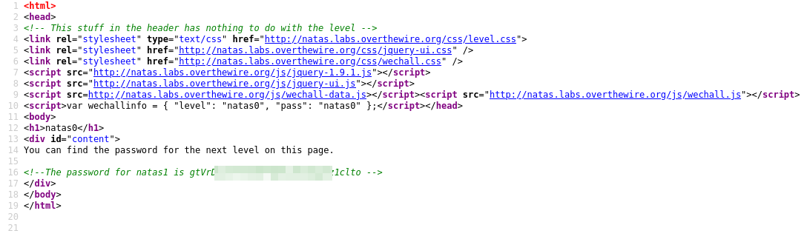
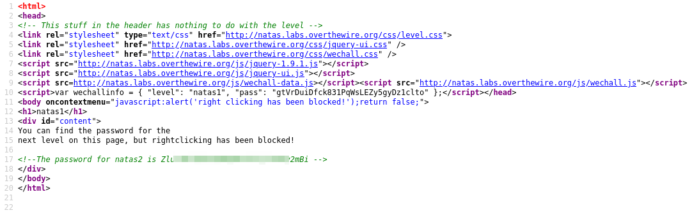
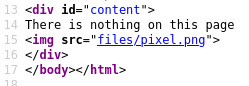
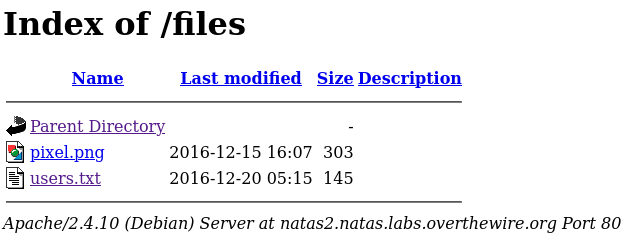
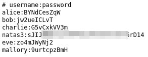
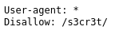
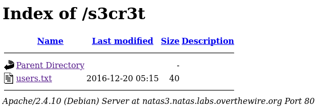
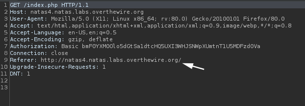
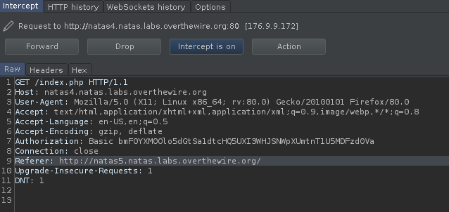
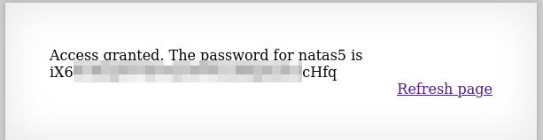

# Wargames / Natas

[*"Natas teaches the basics of serverside web-security."*](https://overthewire.org/wargames/natas/)

0. [Level 0](#level-0) | 10. [Level 10](#level-10) | 20. [Level 20](#level-20) | 30. [Level 30](#level-30)
1. [Level 1](#level-1) | 11. [Level 11](#level-11) | 21. [Level 21](#level-21) | 31. [Level 31](#level-31)
2. [Level 2](#level-2) | 12. [Level 12](#level-12) | 22. [Level 22](#level-22) | 32. [Level 32](#level-32)
3. [Level 3](#level-3) | 13. [Level 13](#level-13) | 23. [Level 23](#level-23)
4. [Level 4](#level-4) | 14. [Level 14](#level-14) | 24. [Level 24](#level-24)
5. [Level 5](#level-5) | 15. [Level 15](#level-15) | 25. [Level 25](#level-25)
6. [Level 6](#level-6) | 16. [Level 16](#level-16) | 26. [Level 26](#level-26)
7. [Level 7](#level-7) | 17. [Level 17](#level-17) | 27. [Level 27](#level-27)
8. [Level 8](#level-8) | 18. [Level 18](#level-18) | 28. [Level 28](#level-28)
9. [Level 9](#level-9) | 19. [Level 19](#level-19) | 29. [Level 29](#level-29)

******

### [LEVEL 0]
To complete this level, just look at the source code of the page.

******

### [LEVEL 1]
You can use the shortcut key of the browser you are using to reach the source code at this level. For firefox: ctrl + u

******

### [LEVEL 2]
When we look at the source code of the page, we will see that it contains a directory called files.

When we enter this directory, we will see that there is a file named users.txt.

`http://natas2.natas.labs.overthewire.org/files/`

We can get the password of the natas3 user from this file.

******

### [LEVEL 3]
When we look at the source code of the page, we see a message like this: *No more information leaks!! Not even Google will find it this time...*

If you search how google indexes a site, you will find information about crawlers. Within this information, you can find that the crawlers are using a file named robots.txt. So we can try looking at the robots.txt file.

`http://natas3.natas.labs.overthewire.org/robots.txt`

Inside this file we found a disallow directory for crawlers to access.

`http://natas3.natas.labs.overthewire.org/s3cr3t/`

There is also a file called users.txt. The information we need is in this file.

******

### [LEVEL 4]
In this section, we will use the burpsuite tool to edit the request we send. Refresh the natas4 page and catch the request you send with burpsuite.

Inside the request, we see a header named referer. We can edit here to make ourselves look like it comes from natas5. Edit here and forward the request.

We got the password.

