# Wargames / Natas

[](https://overthewire.org/)

[*"Natas teaches the basics of serverside web-security."*](https://overthewire.org/wargames/natas/)

0. [Level 0](#level-0) | 10. [Level 10](#level-10) | 20. [Level 20](#level-20) | 30. [Level 30](#level-30)
1. [Level 1](#level-1) | 11. [Level 11](#level-11) | 21. [Level 21](#level-21) | 31. [Level 31](#level-31)
2. [Level 2](#level-2) | 12. [Level 12](#level-12) | 22. [Level 22](#level-22) | 32. [Level 32](#level-32)
3. [Level 3](#level-3) | 13. [Level 13](#level-13) | 23. [Level 23](#level-23)
4. [Level 4](#level-4) | 14. [Level 14](#level-14) | 24. [Level 24](#level-24)
5. [Level 5](#level-5) | 15. [Level 15](#level-15) | 25. [Level 25](#level-25)
6. [Level 6](#level-6) | 16. [Level 16](#level-16) | 26. [Level 26](#level-26)
7. [Level 7](#level-7) | 17. [Level 17](#level-17) | 27. [Level 27](#level-27)
8. [Level 8](#level-8) | 18. [Level 18](#level-18) | 28. [Level 28](#level-28)
9. [Level 9](#level-9) | 19. [Level 19](#level-19) | 29. [Level 29](#level-29)

******

### [LEVEL 0]
To complete this level, just look at the source code of the page.


******

### [LEVEL 1]
You can use the shortcut key of the browser you are using to reach the source code at this level. For firefox: ctrl + u


******

### [LEVEL 2]
When we look at the source code of the page, we will see that it contains a directory called "files".


When we enter this directory, we will see that there is a file named users.txt.

`http://natas2.natas.labs.overthewire.org/files/`


We can get the password of the natas3 user from this file.


******

### [LEVEL 3]
When we look at the source code of the page, we see a message like this: **No more information leaks!! Not even Google will find it this time...**

If you search how google indexes a site, you will find information about crawlers. Within this information, you can find that the crawlers are using a file named robots.txt. So we can try looking at the robots.txt file.

`http://natas3.natas.labs.overthewire.org/robots.txt`


Inside this file we found a disallow directory for crawlers to access.

`http://natas3.natas.labs.overthewire.org/s3cr3t/`


There is also a file called users.txt. The information we need is in this file.

******

### [LEVEL 4]
In this section, we will use the burpsuite tool to edit the request we send. Refresh the natas4 page and catch the request you send with burpsuite.


Inside the request, we see a header named referer. We can edit here to make ourselves look like it comes from natas5. Edit here and forward the request.


We got the password.


******

### [LEVEL 5]
We need to review the request we sent in this section with burpsuite.

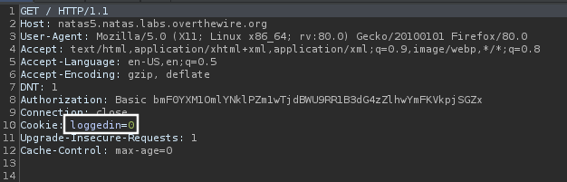

We send a parameter named loggedin in the cookie header. If we change the value of this parameter from 0(negative) to 1(positive), maybe we can be considered as logged in. Change the value and forward the request.

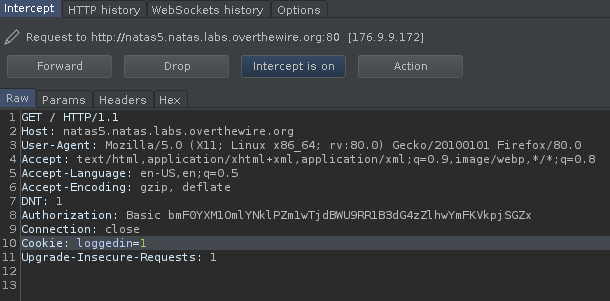

We got the password.

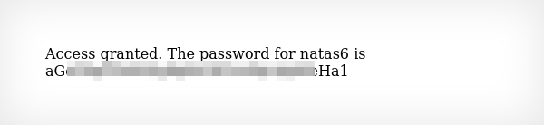

******

### [LEVEL 6]

If we enter the secret text, we will get the password. Let's check the source code.

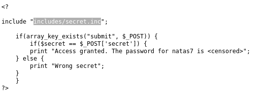

Here we found a directory and filename. When we go to the file, we see a blank page. But if we check the source code, we will find the secret we need to enter the page.

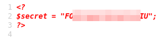

We got the password. 

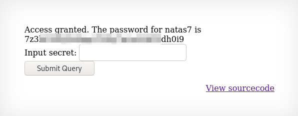

******

### [LEVEL 7]
In this level, we will use the [Directory traversal](https://portswigger.net/web-security/file-path-traversal) attack. If you look at the URL after clicking the home or about button on the page, you will see that the page variable in the index.php file is equal to a file name.

`http://natas7.natas.labs.overthewire.org/index.php?page=home`

Instead of this file, we can write the file where the password of the natas8 user is kept. We have the following information from [Natas](https://overthewire.org/wargames/natas/) homepage: **All passwords are also stored in /etc/natas_webpass/. E.g. the password for natas5 is stored in the file /etc/natas_webpass/natas5 and only readable by natas4 and natas5.** 

Let's try to access the password file.

`http://natas7.natas.labs.overthewire.org/index.php?page=../../../../../../etc/natas_webpass/natas8`

And we got the password.

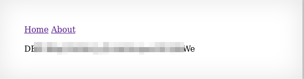

******

### [LEVEL 8]
In this section, we are asked to enter a secret. Let's look at the source code. We can see the encoded secret in the source code. We can also see the encryption algorithm.

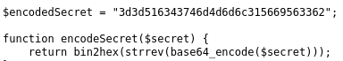

We can decrypt the code by doing the opposite of the encryption process. I will use the [CyberChef](https://gchq.github.io/CyberChef/).

`bin2hex > strrev > base64`

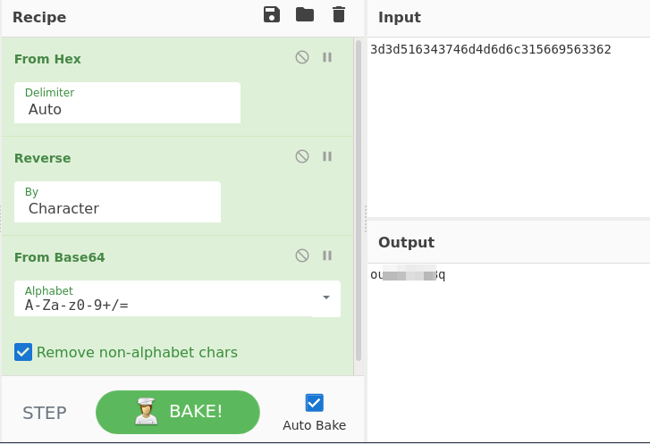

We got the password.

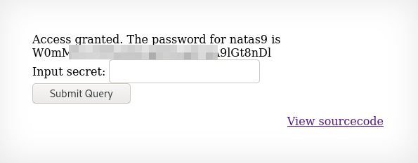

******

### [LEVEL 9]
If we look at the source code of the page, we see that the dictionary.txt file is searched with the grep command. 

`grep -i $key dictionary.txt`

So we can change the terminal command using the ";" sign.

`; cat /etc/natas_webpass/natas10; ls`

So the complete command will look like this:

`grep -i; cat /etc/natas_webpass/natas10; ls dictionary.txt`

We got the password.

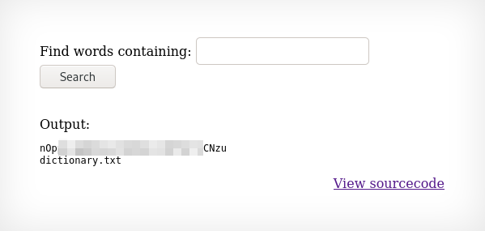

******

### [LEVEL 10]
This section is the same as the previous section, but this time a few values are blocked. Let's look at the source code.

```
if($key != "") {
    if(preg_match('/[;|&]/',$key)) {
        print "Input contains an illegal character!";
    } else {
        passthru("grep -i $key dictionary.txt");
    }
```

As you can see, the characters that we can interfere with the code are blocked. Instead of replacing the code, we can try exploiting the grep command. Let's check what happens when we enter a value like this:

`/bin/bash /etc/passwd`

So the complete command will look like this:

`grep -i /bin/bash /etc/passwd dictionary.txt`

As you can see, there are lines containing the "/bin/bash" in the /etc/passwd file. If we can find any letter that the natas11 user contains, we can access the password. We can try bruteforce to find the password.

`a /etc/natas_webpass/natas11`

So the complete command will look like this:

`grep -i a /etc/natas_webpass/natas11 dictionary.txt`

After a few tries, we learn that the password contains "c".

`c /etc/natas_webpass/natas11`

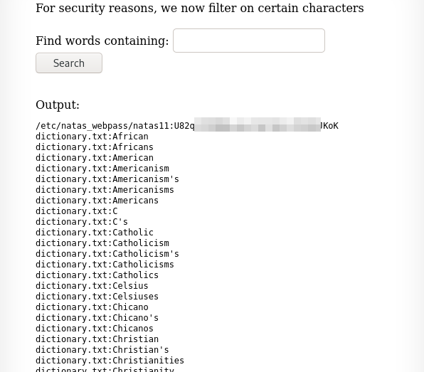

******


